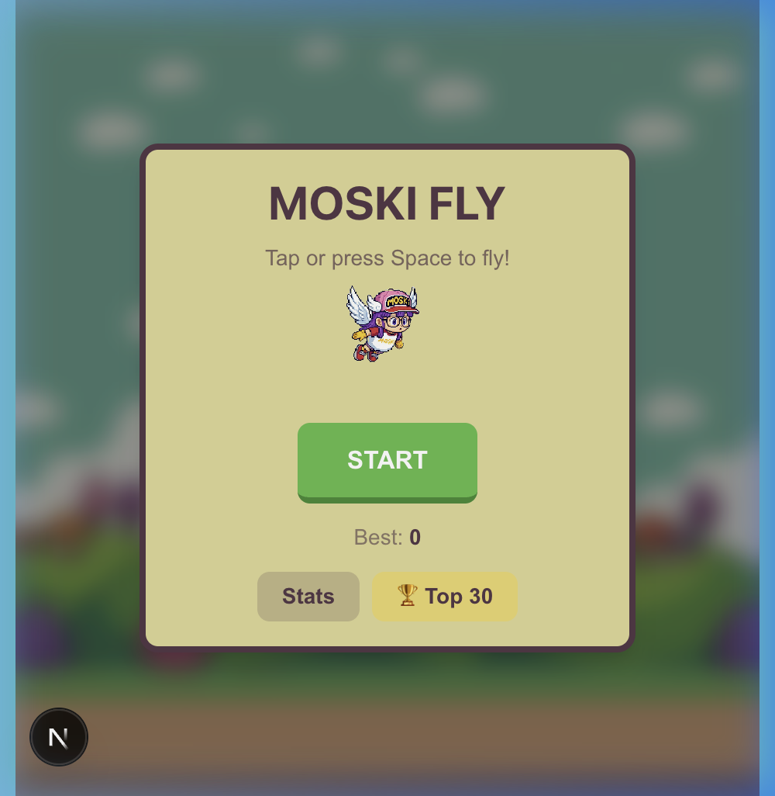
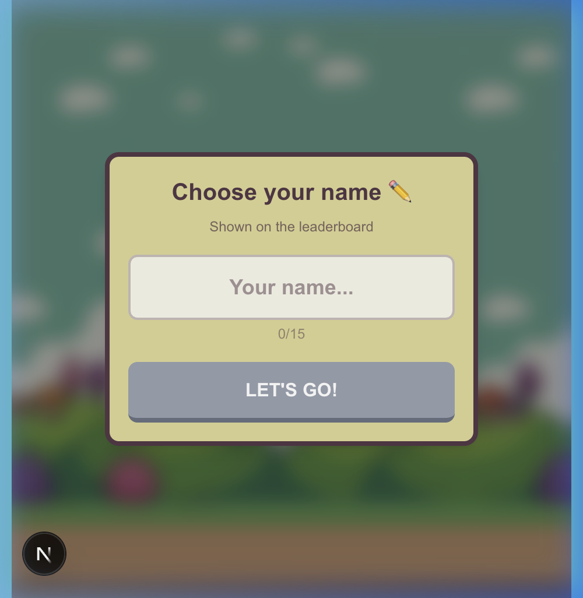

# 🪰 MOSKI FLY

A pixel-art side-scrolling arcade game where you help **Moski** fly through pipes, collect coins & diamonds, and compete on a global leaderboard.

**[▶ Play Now](https://moski-fly.vercel.app)**

<p align="center">
  
  
</p>

---

## 🎮 How to Play

| Input | Action |
|-------|--------|
| **Tap** / **Click** | Flap |
| **Space** / **↑** | Flap (desktop) |

Dodge the pipes, grab coins for bonus points, and catch rare **diamonds** for massive score boosts. Chain coins together to build **combos** (x2 at 3+ streak)!

## ✨ Features

- 🕹️ **Classic arcade gameplay** — simple to learn, hard to master
- 💰 **Coins & Diamonds** — collectibles with combo multiplier
- 🏆 **Global Leaderboard** — Top 30 scoreboard powered by Firebase
- 🔒 **Anti-cheat** — Firebase Anonymous Auth + UID ownership
- 📊 **Statistics** — track your games, best scores, and combos
- 🏅 **Achievement** — reach 10 points to unlock a surprise
- 📱 **Responsive** — works on mobile, tablet, and desktop
- 🔊 **Sound effects** — flap, coins, pipes, game over

## 🏗️ Tech Stack

| Layer | Technology |
|-------|-----------|
| Framework | Next.js 16 (App Router) |
| Language | TypeScript |
| Rendering | HTML5 Canvas |
| Styling | Tailwind CSS |
| Backend | Firebase Firestore + Anonymous Auth |
| Hosting | Vercel |
| Analytics | Vercel Analytics |

## 🚀 Getting Started

```bash
# Clone the repo
git clone https://github.com/fwBoa/moski_fly.git
cd moski_fly

# Install dependencies
npm install

# Add Firebase config
cp .env.local.example .env.local
# Fill in your Firebase credentials

# Run locally
npm run dev
```

Open [http://localhost:3000](http://localhost:3000) in your browser.

## 🔑 Environment Variables

Create a `.env.local` file with:

```env
NEXT_PUBLIC_FIREBASE_API_KEY=your_api_key
NEXT_PUBLIC_FIREBASE_AUTH_DOMAIN=your_project.firebaseapp.com
NEXT_PUBLIC_FIREBASE_PROJECT_ID=your_project_id
NEXT_PUBLIC_FIREBASE_STORAGE_BUCKET=your_project.firebasestorage.app
NEXT_PUBLIC_FIREBASE_MESSAGING_SENDER_ID=your_sender_id
NEXT_PUBLIC_FIREBASE_APP_ID=your_app_id
```

## 📁 Project Structure

```
├── app/                    # Next.js app router
│   ├── layout.tsx          # Root layout + analytics
│   ├── page.tsx            # Game page
│   └── icon.png            # Favicon (Moski sprite)
├── components/Game/
│   ├── Canvas.tsx           # Main game loop & rendering
│   ├── GameOverlay.tsx      # UI overlays (start, game over, modals)
│   ├── Physics.ts           # Gravity, collisions, movement
│   ├── LeaderboardManager.ts # Firebase auth, scores, pseudo
│   ├── StatsManager.ts      # Local statistics tracking
│   ├── SoundManager.ts      # Audio effects
│   └── DevPanel.tsx         # Debug tools (dev only)
├── lib/
│   └── firebase.ts          # Firebase initialization
└── public/sprites/          # Pixel-art game assets
```


